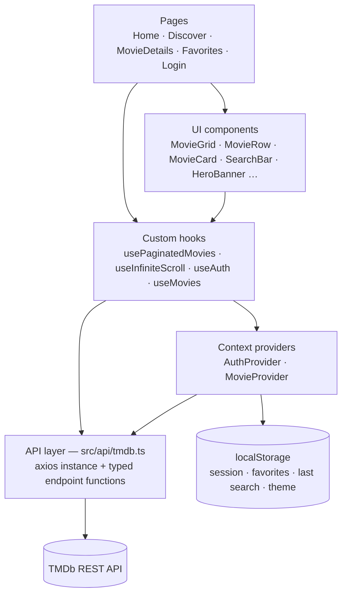
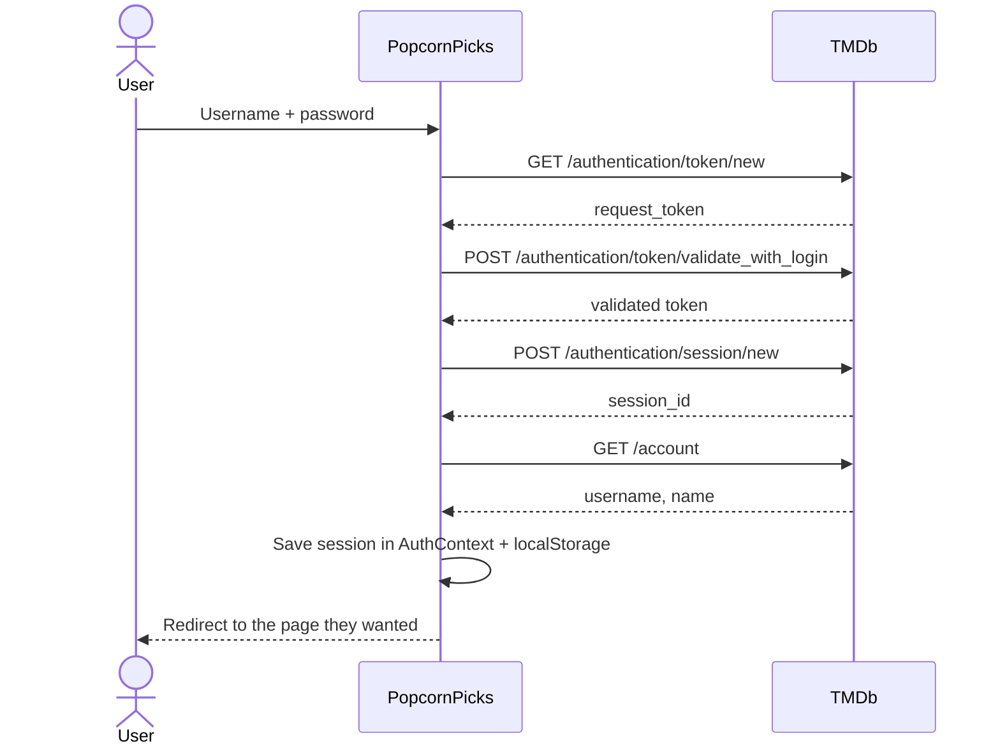

<div align="center">


# PopcornPicks

**Discover trending films, search any movie, and save your favorites.**

A responsive movie explorer built with React, TypeScript and Material UI, powered by live data from [The Movie Database (TMDb)](https://www.themoviedb.org/).

**[🔗 Live demo](https://popcorn-picks-three.vercel.app)** · [GitLab](https://gitlab.com/AshanOdi/PopcornPicks) · [GitHub](https://github.com/AshanOdi/PopcornPicks)

</div>

---

## Table of contents

- [Demo account](#demo-account)
- [Features](#features)
- [Tech stack](#tech-stack)
- [Getting started](#getting-started)
- [Project structure](#project-structure)
- [Architecture](#architecture)
- [TMDb API usage](#tmdb-api-usage)
- [Design decisions](#design-decisions)
- [Deployment](#deployment)
- [Credits](#credits)

---

## Demo account

Just exploring? Click **Continue as guest** on the login page, no account needed.

To try the real login, which uses **TMDb authentication**, sign in with any TMDb account or this demo account:

| Username | Password |
|---|---|
| `ashanfidenz1374` | `Abcd1234` |

> No account? [Create one for free on TMDb](https://www.themoviedb.org/signup) (email verification required).

---

## Features

### Core requirements

| Requirement | Implementation |
|---|---|
| Login with username and password | Real TMDb login (request token → validate with login → session), plus a **Continue as guest** option. Protected routes redirect to `/login` and return the user to the page they wanted afterwards. |
| Search bar | Debounced search (500 ms) so the API is called once the user stops typing, not on every keystroke. Enter searches immediately. |
| Poster grid with title, year and rating | Responsive grid (2 / 3 / 5 / 6 columns) that always fills complete rows. |
| Movie details | Backdrop hero, poster, overview, genres, runtime, rating, release date, auto-scrolling top cast and YouTube trailer. Details, cast and videos arrive in **one** request. |
| Trending movies | Home page rows plus a featured "#1 Trending" hero banner. |
| Light / dark mode | MUI color schemes. Follows the OS setting by default and remembers the user's choice. |
| Infinite scrolling for search results | `IntersectionObserver` on a sentinel element loads the next page 400 px before the user reaches the bottom. |
| Friendly API errors | Every request error becomes a readable message (network down, 401, 404, 429…) with a **Try again** button. |
| React Context API | `AuthContext` (session and user) and `MovieContext` (last search and favorites). |
| Last search persisted | Stored in `localStorage` and restored after a refresh. |
| Favorites stored locally | Heart button on every card and on the details page; a dedicated Favorites page. |

### Bonus features

| Bonus | Implementation |
|---|---|
| Filter by genre, year and rating | Discover page using TMDb's `/discover/movie` endpoint. Filters live in the URL, so they are shareable and work with the Back button. |
| YouTube trailers | Picks the best video (official trailer → trailer → teaser) and plays it in a dialog. |
| "Load More" button | Used on Discover and "See all" lists. Search keeps infinite scroll, so both techniques are shown where each fits best. |

### Extras

- **Home browsing rows:** Trending, Top rated and Now playing, with swipe on mobile, arrows on desktop and **See all** links.
- **Cinematic hero banner:** full-width backdrop with rating, runtime, language, genres, a trailer play button and favorite action.
- **Mobile-first navigation:** a floating glass bottom bar on phones and a floating glass top bar that appears on scroll.
- **Polish:** skeleton loaders shaped like the real content, a "+1" animation when a favorite is added, and scroll-to-top on navigation.
- **Accessibility:** semantic landmarks, ARIA labels on icon buttons, keyboard-friendly controls, and `prefers-reduced-motion` support.

---

## Tech stack

| Area | Choice |
|---|---|
| Framework | [React 19](https://react.dev/) + [TypeScript](https://www.typescriptlang.org/) (strict mode) |
| Build tool | [Vite](https://vite.dev/) |
| UI library | [Material UI (MUI) v9](https://mui.com/) + MUI Icons |
| Routing | [React Router v7](https://reactrouter.com/) |
| HTTP client | [axios](https://axios-http.com/) |
| State management | React Context API + `localStorage` |
| Linting | [oxlint](https://oxc.rs/) |
| Hosting | [Vercel](https://vercel.com/) |

---

## Getting started

### Prerequisites

- **Node.js** 20.19+ or 22.12+
- A free **TMDb API Read Access Token**: [themoviedb.org → Settings → API](https://www.themoviedb.org/settings/api)

### Setup

```bash
# 1. Clone (GitLab or GitHub, same code)
git clone https://gitlab.com/AshanOdi/PopcornPicks.git
cd PopcornPicks

# 2. Install dependencies
npm install

# 3. Add your TMDb token
cp .env.example .env
# then open .env and set VITE_TMDB_TOKEN=<your API Read Access Token>

# 4. Start the dev server
npm run dev
```

Open http://localhost:5173 and sign in with the [demo account](#demo-account).

### Scripts

| Command | What it does |
|---|---|
| `npm run dev` | Start the development server with hot reload |
| `npm run build` | Type-check, then build for production into `dist/` |
| `npm run preview` | Serve the production build locally |
| `npm run typecheck` | Run the TypeScript compiler without emitting files |
| `npm run lint` | Lint the source with oxlint |

### Environment variables

| Variable | Description |
|---|---|
| `VITE_TMDB_TOKEN` | TMDb **API Read Access Token** (v4 "Bearer" token). Sent as `Authorization: Bearer …` on every request. |

> `.env` is git-ignored. Vite only exposes variables prefixed with `VITE_` to the browser.

---

## Project structure

```
src/
├── api/
│   └── tmdb.ts                 # axios instance, every TMDb endpoint, error messages, image URLs
├── components/
│   ├── Layout.tsx              # Navbar + page (<Outlet />) + Footer + BottomNav
│   ├── Navbar.tsx              # Floating glass top bar (desktop links, theme, user menu)
│   ├── BottomNav.tsx           # Floating bottom navigation on phones
│   ├── ProtectedRoute.tsx      # Redirects to /login when signed out
│   ├── HeroBanner.tsx          # Full-width featured movie
│   ├── MovieRow.tsx            # Horizontal row with arrows + "See all"
│   ├── MovieGrid.tsx           # Responsive grid that always fills complete rows
│   ├── MovieCard.tsx           # Poster, title, year, rating, favorite heart
│   ├── PaginatedMovieGrid.tsx  # Any TMDb list with Load More
│   ├── SearchBar.tsx           # Debounced search input
│   ├── SearchResults.tsx       # Search results with infinite scroll
│   ├── MovieFiltersBar.tsx     # Genre / year / rating dropdowns
│   ├── CastList.tsx            # Cast row: slow back-and-forth auto-scroll + manual scroll
│   ├── TrailerButton.tsx       # YouTube trailer dialog (button or play circle)
│   ├── FavoriteButton.tsx      # Add/remove favorite (icon or button)
│   ├── ErrorAlert.tsx          # Friendly error with retry
│   └── …                       # Logo, Footer, ThemeToggle, UserMenu, skeletons, arrows
├── context/
│   ├── AuthContext.ts / AuthProvider.tsx    # Session + user, login / logout
│   └── MovieContext.ts / MovieProvider.tsx  # Last search + favorites (localStorage)
├── hooks/
│   ├── useAuth.ts / useMovies.ts   # Typed access to the contexts
│   ├── usePaginatedMovies.ts       # Shared pagination: load, append, dedupe, retry
│   ├── useInfiniteScroll.ts        # IntersectionObserver trigger
│   ├── useAutoScroll.ts            # Slow back-and-forth auto-scroll that pauses on interaction
│   └── useNavItems.tsx             # Nav links shared by top and bottom bars
├── pages/
│   ├── Home.tsx                # Hero + search + rows / search results
│   ├── Discover.tsx            # List tabs + filters (state in the URL)
│   ├── MovieDetails.tsx        # Details, cast, trailer
│   ├── Favorites.tsx           # Saved movies
│   ├── Login.tsx               # TMDb sign-in form
│   └── NotFound.tsx            # 404
├── types/tmdb.ts               # TypeScript types for TMDb responses
├── utils/                      # Formatting and scroll helpers
├── theme.ts                    # MUI theme: light/dark palettes, typography, component styles
├── App.tsx                     # Providers + routes
└── main.tsx                    # Entry point: ThemeProvider + CssBaseline
```

---

## Architecture

### Layers

Components never call axios directly. Each layer has one job:



### Routing

| Path | Page | Access |
|---|---|---|
| `/login` | Login | Public |
| `/` | Home: hero, search and rows | Protected |
| `/discover?list=…` / `?genre=&year=&rating=` | Discover | Protected |
| `/movie/:id` | Movie details | Protected |
| `/favorites` | Favorites | Protected |
| `*` | 404 | Protected |

All protected pages share one `Layout` route wrapped in `ProtectedRoute`, so the guard, navbar and footer are defined once.

### State management

| State | Where | Persisted |
|---|---|---|
| Session + user account (or guest) | `AuthContext` | `localStorage` (`popcornpicks_auth`) |
| Favorites | `MovieContext` | `localStorage` (`popcornpicks_favorites`) |
| Last search | `MovieContext` | `localStorage` (`popcornpicks_last_search`) |
| Theme (light/dark) | MUI `useColorScheme` | `localStorage` (`mui-mode`) |
| Discover list and filters | URL query string | Shareable link and Back button |
| Page data (movies, loading, errors) | Local component state via hooks | No |

Favorites store only the five fields a card needs, not the full API object, to keep storage small.

### Login flow



### Pagination

TMDb returns **20 movies per page**. One hook, `usePaginatedMovies`, handles every list. It fetches a page, appends it, removes duplicates across pages, and exposes `loadMore` and `retry`. Each screen then chooses how to trigger the next page:

| Screen | Trigger |
|---|---|
| Search results | **Infinite scroll** (`useInfiniteScroll`) |
| Discover and "See all" | **Load More** button |
| Home rows | First page only, with "See all" for more |

`MovieGrid` knows how many columns are on screen. While more pages are coming, it holds back leftover movies so the grid always ends on a complete row.

---

## TMDb API usage

All calls go through one axios instance in [`src/api/tmdb.ts`](src/api/tmdb.ts) with the base URL, a Bearer token and a 10 s timeout.

| Feature | Endpoint |
|---|---|
| Trending | `GET /trending/movie/week` |
| Top rated | `GET /movie/top_rated` |
| Now playing | `GET /movie/now_playing` |
| Search | `GET /search/movie?query=&page=` |
| Details + cast + trailers | `GET /movie/{id}?append_to_response=credits,videos` |
| Genre list | `GET /genre/movie/list` |
| Filters | `GET /discover/movie?with_genres=&primary_release_year=&vote_average.gte=` |
| Login | `/authentication/token/new` → `/authentication/token/validate_with_login` → `/authentication/session/new` |
| Account | `GET /account` |
| Logout | `DELETE /authentication/session` |
| Images | `https://image.tmdb.org/t/p/{size}{path}` |

**Error handling:** `getErrorMessage()` turns axios errors into user-facing text: *network error*, *invalid credentials/token* (401), *not found* (404), *too many requests* (429), or TMDb's own message. Each section fails on its own, so if one Home row fails, the rest of the page keeps working.

---

## Design decisions

- **Vite instead of Create React App.** CRA was deprecated in 2025. Vite is the officially recommended replacement: faster dev server, faster builds, and first-class TypeScript support.
- **TypeScript in strict mode.** Typed API responses (`Movie`, `MovieDetails`, `PaginatedResponse<T>`) catch mistakes at build time and give autocomplete across the app. `npm run build` fails on type errors.
- **Real TMDb login instead of a mock.** It meets the "username and password" requirement with actual authentication and sessions.
- **Infinite scroll *and* Load More.** The brief asks for infinite scroll on search results and offers Load More as a bonus. Search uses infinite scroll; browsing lists use Load More, which keeps the footer and bottom navigation reachable.
- **Filters in the URL.** Discover state is stored in the query string, so filtered views can be bookmarked or shared and the Back button undoes filter changes.
- **Reset with `key`.** Search results, filtered lists and details pages are keyed by their input, so React remounts them with fresh state instead of manual reset logic.
- **One request per details page.** `append_to_response=credits,videos` avoids three separate calls.
- **Mobile-first.** Layouts start at phone size and scale up with MUI breakpoints. Phones get a bottom navigation bar within thumb reach.

---

## Deployment

The app is a static single-page app, deployed on **Vercel** at **https://popcorn-picks-three.vercel.app**. Every push to `main` redeploys automatically.

1. Import the repository on [vercel.com/new](https://vercel.com/new). The framework preset **Vite** is detected automatically.
2. Add the environment variable `VITE_TMDB_TOKEN`.
3. Deploy.

[`vercel.json`](vercel.json) rewrites every path to `index.html`, so deep links such as `/movie/550` work on refresh.

---

## Credits

- Movie data and images from [TMDb](https://www.themoviedb.org/). *This product uses the TMDB API but is not endorsed or certified by TMDB.*
- Built by **Ashan Odithya**.
